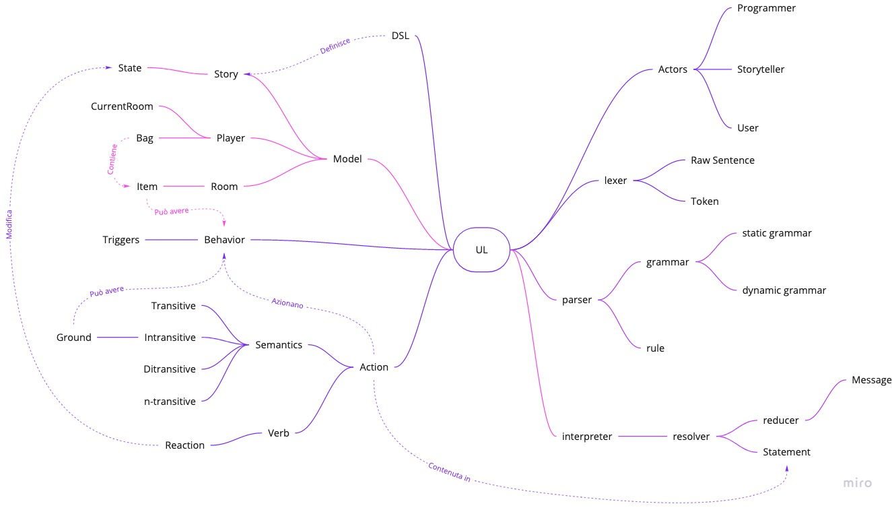
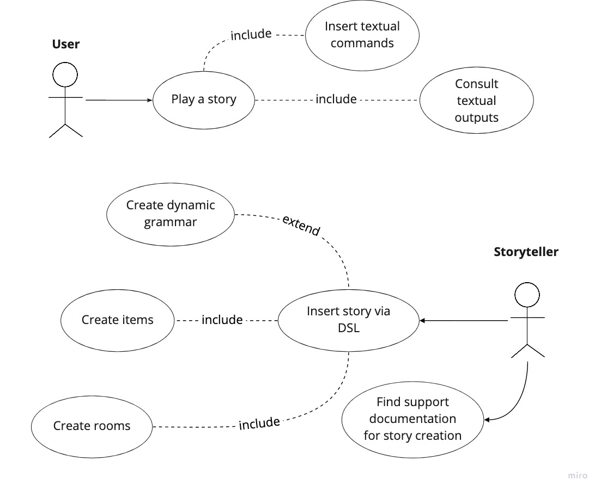
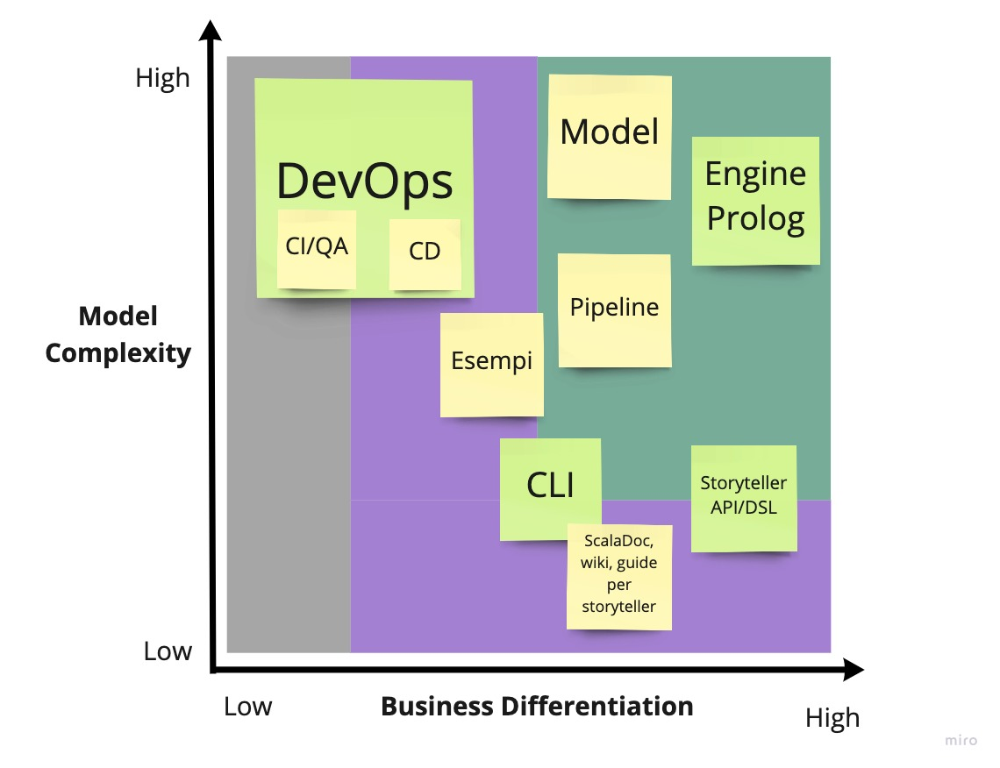

# Aspetti di Domanin Driven Design

<!-- Descrizione approfondita della sessione di knowledge chrunching
iniziale, screen da miro, focus sul glossario, use cases, altro,
accenno al fatto che poi ciò è stato utilizzato e si è evoluto in
parte con l'avanzare del progetto

NB: oltre a descrivere l'output, sarebbe bene focalizzarsi e descrivere
bene il processo che ha portato a definirli.
-->

Sin dalle prime iterazioni di progetto, particolare attenzione è stata posta
nell'utilizzo di metodologie di topo Domain Driven. Nella pratica,
[una board collaborativa **Miro**](https://miro.com/app/board/o9J_lfd9ZK0=/) è
stata utilizzata per mettere nero su bianco idee e concetti base. È bene
sottolineare che oltre ai costrutti richiesti dal DDD, la board contiene anche
molteplici sketch che hanno portato il gruppo alla definizione di vari
componenti.

## Knowledge Crunching

Prima ancora di mettere mano all'architettura di progetto, per diverse settimane
sono state portate avanti sessioni di knowledge crunching che hanno visto la
partecipazione di tutti i membri del team. Scopo di queste sessioni era lo
studio del dominio applicativo, e la definizione di paletti tali da guidare lo
sviluppo in un'ottica DDD.

Si sono in primo luogo andati a delineare in linea di massima i casi d'uso, per
poi definire Ubiquitous Language e Bounded Context. Alla prima bozza degli
stessi sono seguiti raffinamenti successivi, fino alla definizione di una
struttura quanto più precisa e dettagliata.

Dal documento di Scrum Overview allegato in appendice è possibile individuare
chiaramente come il primo Sprint tracciato (quello conseguente all'approvazione
del progetto da parte del prof. Viroli) è stato interamente dedicato a questa
fase. È però importante sottolineare come il lavoro di knowledge crunching sia
iniziato ben prima, seppir con minore impegno, già dagli inizi di dicembre,
ovvero dalla data di sottomissione dello stesso.

## Ubiquitous Language

Di particolare importanza si è rilelvata l'individuazione di un Ubiquitous
Language associato ai concetti alla base del progetto. Qui ne viene riportata la
versione finale, che comprende tutti i concetti principali. Sulla
[board Miro](https://miro.com/app/board/o9J_lfd9ZK0=/) è disponibile una
versione dello stesso nel quale viene ampliata la descrizione di ogni termine.

## Individuazione dei requisiti e dei casi d'uso

Nell'ambito di progetto sono stati individuati due principali attori, tali da
interagire con lo stesso. Sulla base della loro definizione, sono stati quindi
individuati vari casi d'uso:

- **Storyteller**: rappresenta l'attore in grado di creare delle storie
  giocabili. Questo è di fatto un programmatore che usufruisce del framework, e
  si assume quindi presenti delle conoscenze di programmazione Scala. La
  creazione della storia consiste nella creazione delle `Room` e degli `Item` ad
  essi associate (includendo come parte di questa interazione la definizione del
  _come_ tali entità reagiscono ai comandi utente), e alla definizione della
  grammatica alla base del motore per il riconoscimento dei comandi;

- **User**: il termine indica l'attore che usufruisce della storia giocabile.
  Esso interagisce con il sistema immettendo comandi testuali, e consultandone
  l'output risultante.

## Bounded context e Context map

A seguito dell'individuazione dei casi d'uso, si è andata a espandere l'analisi
andando ad individuare i principali bounded context associati al progetto.

L'immagine riporta i principali bounded context, disposti con particolare
attenzione alla complessità di modellazione degli stessi e all'importanza per il
business. Si è intesa quest'ultima misura come rilevanza ti tale context, dal
punto di vista di user e storyteller. Dal grafico si può individuare anche come
le operazioni DevOps siano state elevate a vero e proprio bounded context: in
ottica di effettuare un progetto di esame per LSS, esso rappresenta un vero e
proprio requisito, ad alta complessità. L'utente finale, inteso come
storyteller/user, può percepire da tali operazioni benefici indiretti (es. nella
velocità delle release, nella qualità dell'API), ma di fatto maniera indiretta.

I bounded context individuati nella sezione verde del grafico rappresentano i
context core di progetto.

<!-- todo individuazione della mappa dei context estesa -->
