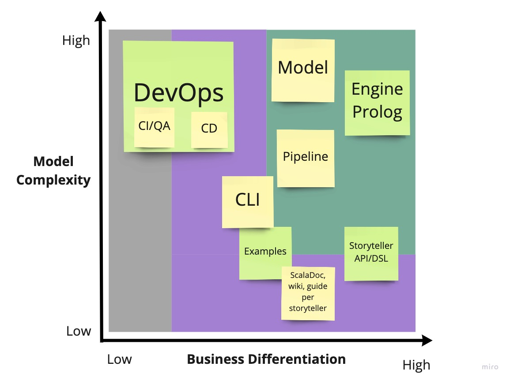

# Aspetti di Domain Driven Design

Sin dalle prime iterazioni di progetto, particolare attenzione è stata posta
nell'utilizzo dell'approccio Domain Driven Design. Nella pratica,
[una board collaborativa **Miro**](https://miro.com/app/board/o9J_lfd9ZK0=/) è
stata utilizzata per mettere nero su bianco idee e concetti base. È bene
sottolineare che oltre ai costrutti richiesti dal DDD, la board contiene anche
molteplici sketch che hanno portato il gruppo alla definizione di vari
componenti.

## Knowledge Crunching

Prima ancora di mettere mano all'architettura di progetto, per diverse settimane
sono state effettuate sessioni di knowledge crunching che hanno visto la
partecipazione di tutti i membri del team. Scopo di queste sessioni era lo
studio del dominio applicativo, e la definizione di requisiti tali da guidare lo
sviluppo in un'ottica DDD.

In primo luogo si sono andati a delineare in linea di massima i casi d'uso, per
poi definire Ubiquitous Language e Bounded Context. Alla prima bozza degli
stessi sono seguiti raffinamenti successivi, fino alla definizione di una
struttura quanto più precisa e dettagliata.

Dal documento di Scrum Overview allegato in appendice è possibile individuare
chiaramente come il primo Sprint tracciato (quello conseguente all'approvazione
del progetto da parte del prof. Viroli) è stato interamente dedicato a questa
fase. È però importante sottolineare come il lavoro di knowledge crunching sia
iniziato ben prima, seppur con minore impegno, già dagli inizi di dicembre,
ovvero dalla data di sottomissione dello stesso.

## Ubiquitous Language

Di particolare importanza si è rilevata l'individuazione di un Ubiquitous
Language originato dai concetti base del progetto. In @fig:ul viene riportata la
versione finale, che comprende tutti i concetti principali. Sulla
[board Miro](https://miro.com/app/board/o9J_lfd9ZK0=/) è disponibile una
versione dello stesso nel quale viene ampliata la descrizione di ogni termine.

{#fig:ul}

## Individuazione dei requisiti e dei casi d'uso

Nell'ambito di progetto sono stati individuati due principali attori, tali da
interagire con lo stesso. Sulla base della loro definizione, sono stati quindi
individuati vari casi d'uso, riportati in @fig:usecase:

- **Storyteller**: rappresenta l'attore in grado di creare delle storie
  giocabili. Questo è di fatto un programmatore che usufruisce del framework, e
  si assume quindi che abbia delle conoscenze di programmazione Scala. La
  creazione della storia consiste nella definizione delle `Room` e degli `Item`
  ad essa associati (includendo come parte di questa interazione la descrizione
  di _come_ tali entità reagiscono ai comandi utente), e alla definizione dei
  verbi che comporranno la grammatica di una specifica storia;

- **User**: il termine indica l'attore che usufruisce della storia giocabile.
  Esso interagisce con il sistema immettendo comandi testuali, e consultandone
  l'output risultante.

{#fig:usecase}

## Bounded context e Context map

A seguito dell'individuazione dei casi d'uso, si è andata a espandere l'analisi
al fine di individuare i principali bounded context associati al progetto.

{#fig:bcontextan}

L'immagine @fig:bcontextan riporta i principali bounded context, posti nel
grafico in base alla complessità di modellazione degli stessi e all'importanza
per il business. Si è intesa quest'ultima misura come la rilevanza di tale
context, dal punto di vista di user e storyteller. Dal grafico si può evincere
anche come le operazioni DevOps siano state elevate a vero e proprio bounded
context: in ottica di effettuare un progetto di esame per LSS, esso rappresenta
un vero e proprio requisito, ad alta complessità. L'utente finale, inteso come
storyteller/user, può percepire da tali operazioni benefici indiretti (es. nella
velocità delle release, nella qualità dell'API).

Sulla base di questa analisi preliminare, si è andata quindi a definire la
context map, mostrata in @fig:contextmap.

{#fig:contextmap}

Nello specifico, si è andato a accorpare quelli che erano stati individuati come
bounded context di primaria importanza, in un unico **Core** bounded context.
Questo in quanto, concettualmente, rappresentano moduli strettamente collegati.

Il bounded context **Storyteller Application** include ciò che concerne
l'implementazione di vere e proprie UI per l'interazione con l'utente. HTML è
stato rappresentato come tratteggiato, in quanto rappresenta un elemento da
valutare in corso d'opera.

**Storyteller Support** include tutto ciò che concerne il supporto per lo
storyteller alla costruzione della propria storia. In una libreria di queste
dimensioni, fornire della documentazione di supporto diventa infatti un
requisito di primaria importanza.

Infine, è stato definito un bounded context anche per ciò che concerne le
pratiche **DevOps**. Graficamente, essi sono sono collegati agli altri bounded
context. Ma non per il fatto di non influenzare gli altri; anzi, i collegamenti
non sono rappresentati per il semplice fatto che il primo contiene degli
elementi per loro natura pervasivi, che influenzano in maniera indiretta a tutti
gli altri bounded context.
