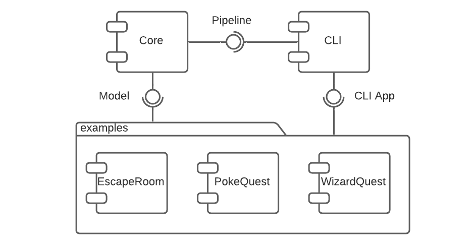
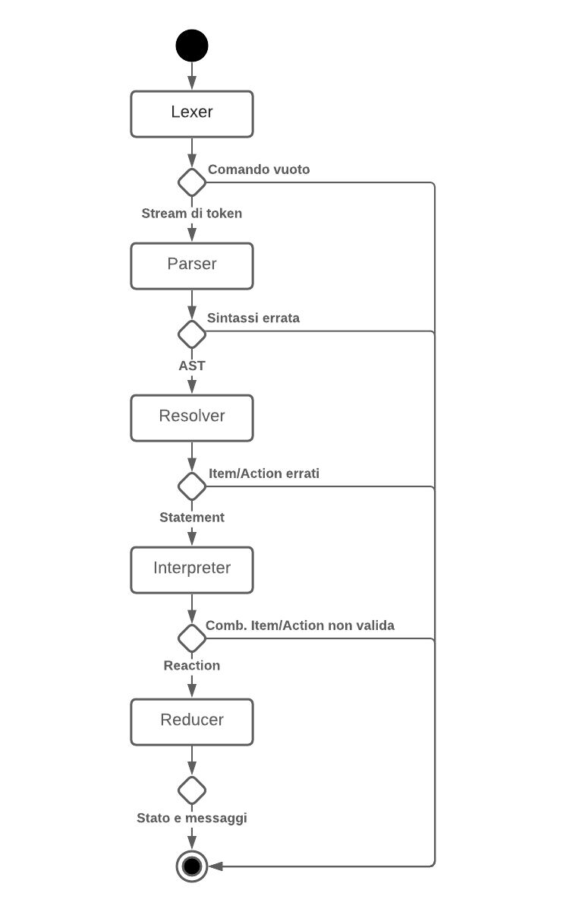

# Design architetturale

Il gioco si struttura dal punto di vista dello user in diverse **iterazioni**,
per ognuna delle quali viene intercettato l'input utente (in linguaggio
naturale), e a seguito di varie elaborazioni viene restituita una risposta (in
formato testuale, o in altri formati).

Risulta quindi naturale implementare ogni iterazione come una funzione, che dato
un comando testuale e lo stato del gioco, restituisce lo stato modificato e
l'output per l'utente. Faremo riferimento a questa funzione con il nome di
**pipeline**, essendo di fatto strutturata come una vera e propria "catena di
montaggio", come verrà in seguito descritto.

L'architettura di progetto si fonda tutto attorno a questa funzione. Sarà di
fatto necessario un modulo incaricato di prendere un comando utente e
restituirne l'output, e un modulo incaricato d'iterare la stessa, tale da
comporre una sessione di gioco completa.

Parallelamente alla gestione della pipeline, dovrà essere resa disponibile
un'API per lo storyteller, così da permettere a lui di creare nuove storie
basate su questo modello.

## Architettura di massima

Si è organizzato quindi il sistema in più macro-componenti, corrispondente
ognuno a un sotto-progetto Gradle separato. Le loro relazioni sono riportate
tramite il diagramma dei componenti a @fig:maincomponents. Sono stati
individuati:

- Il modulo **Core**, che implementa l'engine di gioco, la pipeline, e il
  necessario per rendere possibile modellare nuove storie;

- Il modulo **CLI**, che fornisce un'implementazione in grado di eseguire
  sessioni di gioco basate su Command Line Interface. Il modulo include _Core_
  come dipendenza, rappresentando da solo la libreria necessaria per generare
  storie interagibili a linea di comando;

- I moduli **Examples**, che rappresentano dei giochi di esempio, andando a
  mostrare le modalità consigliate per l'utilizzo di _CLI_ nell'implementazione
  di storie.

{#fig:maincomponents}

In seguito si vanno ad approfondire le caratteristiche dei singoli moduli.

### Core

Il modulo **Core** rappresenta l'elemento centrale del sistema, tale da
implementare l'engine di gioco, la pipeline, e il necessario per rendere
possibile modellare nuove storie. È strutturato ad alto livello in molteplici
sezioni, corrispondenti in linea di massima a package separati:

- **Model**: contiene tutti i componenti e gli strumenti necessari a modellare
  una storia;

- **Parsing**: contiene le logiche alla base della fase di parsing della
  pipeline, ovvero ciò che concerne l'interpretazione dell'input testuale
  dell'utente tramite l'interprete Prolog.

- **Application**: comprendono delle utility per dare un "template" di base alle
  storie, facilitandone la costruzione, e la generazione delle regole
  grammaticali Prolog utili alla fase di parsing;

- **Dictionary**: contiene tutti gli elementi che definiscono il vocabolario
  utilizzato dal giocatore all'interno di una storia. In particolare è composto
  da un insieme di oggetti e un insieme di verbi;

- **Pipeline**: definisce l'elaborazione di una singola iterazione di gioco,
  dall'input di un comando testuale e dello stato del gioco, all'output dello
  stato stesso modificato e del contenuto visualizzato dall'utente.
  L'elaborazione si struttura in differenti fasi, rappresentate in
  @fig:pipeline. Ogni fase è a sua volta contenuta in un package differente:

  1. **Lexer**: dato l'input dello user, lo si sottopone ad un'analisi
     lessicale, volta alla creazione di uno stream di token. Ogni token
     corrisponde ad una parola, distinta in base alla separazione tramite spazi;

  2. **Parser**: dato il risultato del `Lexer`, lo si sottopone ad un'analisi
     sintattica tramite l'interprete Prolog, dalla quale viene generato un
     Abstract Syntax Tree;

  3. **Resolver**: dato il risultato del `Parser`, si associa ad ogni suo
     elemento un significato, producendo uno `Statement`, ossia un comando
     comprensibile dal modello;

  4. **Interpreter**: dato il risultato del `Resolver`, si verifica che sia
     possibile applicare lo `Statement` sullo stato corrente del gioco. Quando
     possibile, viene generata una **Reaction** ossia una funzione contenente le
     eventuali modifiche da applicare sullo stesso, e tale da tener traccia
     dell'output da mostrare all'utente;

  5. **Reducer**: data la `Reaction` ottenuta al termine del passo precedente,
     si provvede ad applicarla allo stato corrente del gioco, aggiornandolo e
     generando eventuali messaggi utili per l'interazione con lo user.

{#fig:pipeline}

### CLI

Il modulo **CLI** fornisce un'implementazione in grado di eseguire sessioni di
gioco basate su Command Line Interface. Il modulo include _Core_ come
dipendenza, rappresentando da solo la libreria necessaria per generare storie a
linea di comando.

L'implementazione fornita itera di fatto l'esecuzione della pipeline. È
possibile individuare, per ogni iterazione, le seguenti fasi:

1. Viene letta la frase inserita dallo user;
2. Viene messa in azione la pipeline che restituisce un risultato;
3. Viene creato il messaggio di risposta in base a ciò che restituisce la
   pipeline;
4. Viene stampato a video il messaggio di risposta;
5. Se il gioco è terminato, viene chiusa la sessione, altrimenti si ricomincia
   il ciclo.

### Examples

Sono state incluse all'interno del progetto diverse storie di **esempio**,
generate tramite l'utilizzo del modulo _CLI_:

1. **EscapeRoom**: lo user si trova all'interno di uno scantinato con vari
   oggetti coi quali è concessa l'interazione. La storia si focalizza
   sull'utilizzo di vari builder preimpostati per la generazione della stessa;

2. **PokeQuest**: lo user viene catapultato nel mondo Pokemon. La storia mostra
   come sia possibile generare dei componenti completamente custom, limitando
   l'utilizzo di builder;

3. **WizardQuest**: lo user si ritrova nei panni di Harry Potter all'interno
   della Camera dei Segreti. La storia mostra come sia agevole spostare oggetti
   tra le varie stanze.

## Pattern architetturali

La gestione dello stato all'interno del progetto si ispira al pattern
architetturale
**[Flux](https://facebook.github.io/flux/docs/in-depth-overview)**.

Il flusso di dati di questa applicazione segue un percorso unidirezionale
ciclico. Quest'ultima soluzione in particolare, risulta essere molto efficace
con il problema definito in questo progetto in quanto ad ogni input generato
dallo user viene aggiornato lo stato. Il prossimo input utente viene valutato a
partire del nuovo stato attuale.

In questo paradigma viene considerato come punto centrale il nodo
**Dispatcher**, attraverso il quale fluiscono tutti i flussi di dati. Nel nostro
caso questo concetto è stato esploso ed è stato implementato attraverso la
creazione della pipeline.

## Scelte tecnologiche

Al fine di rispettare i requisiti proposti, sono state effettuate delle scelte
su alcune tecnologie che hanno influenzato poi anche in maniera importante
alcune scelte architetturali.

### TuProlog

**TuProlog** rappresenta la libreria scelta per quanto concerne la creazione del
motore Prolog di Natural Language Processing. Si è scelta questa libreria per
avere una solida base per la fase di parsing.

Le motivazioni per cui è stata scelta sono molteplici:

- perfetta integrazione tra tuProlog e il mondo JVM e questo ha consentito di
  utilizzare Prolog all'interno del linguaggio Scala senza particolari
  problematiche dovute all'integrazione di API diverse;

- possibilità di utilizzare la **grammatica Prolog DCG** importando una piccola
  parte aggiuntiva alla libreria.

Tra i possibili svantaggi derivanti dall'utilizzo della libreria _tuProlog_ vi
potrebbe essere un problema legato alle prestazioni. Essendo sviluppata in Java
e quindi su JVM, potrebbero non essere ottimizzati i tempi attraverso i quali
vengono esplorate le soluzioni Prolog.

Tuttavia nel nostro progetto il Prolog non viene richiamato in maniera
intensiva, ma il suo utilizzo si limita alla parte della pipeline che esegue
l'analisi sintattica della frase inserita dal player. Per questo motivo, non
sussistono problemi di prestazione legati alla libreria utilizzata.

### ZIO

Per quanto riguarda la gestione di side effect e azioni asincrone si è scelto di
utilizzare **ZIO**, una libreria che fornisce costrutti per la manipolazione di
effetti utilizzando un approccio funzionale, in maniera _type-safe_, quindi
facilmente componibili e testabili.

Il nucleo di ZIO è definito dal tipo `ZIO[R, E, A]`, nel quale:

- `R` rappresenta l'ambiente necessario affinché l'effetto possa essere
  eseguito;
- `E` rappresenta il tipo dell'errore che la computazione potrebbe causare;
- `A` rappresenta il tipo di ritorno nel caso in cui l'effetto vada a buon fine.

Il tutto può essero vista come una versione con side-effect di una funzione
`R => Either[E, A]`.

### Monocle Lens

Al fine di leggere e trasformare oggetti immutabili si è scelto di utilizzare la
libreria **Monocle**, in particolare il costrutto `Lens`, le quali mettono a
disposizione un'API semplice e componibile per modificare oggetti anche
innestati, senza dover ricorrere all'uso del metodo `copy`. La libreria fornisce
una macro `GenLens`, che consente la creazione di `Lens` a partire da una case
class, rendendo questa fase molto semplice.

L'uso di questi costrutti è risultato molto utile soprattutto nelle modifiche a
strutture quali `State` e `Room`.

### Cats

Durante la fase di analisi è emersa la necessità di accordarsi su quale
implementazione di type classes utilizzare nel caso in cui si volessero scrivere
algoritmi o strutture dati utilizzando un approccio funzionale.

È stato deciso di utilizzare **Cats**, in quanto mette a disposizione un insieme
di astrazioni, ispirate alla teoria delle categorie, che permettono di sfruttare
al massimo le caratteristiche della programmazione funzionale. La scelta di Cats
piuttosto che **Scalaz** è stata dettata principalmente dal fatto che la prima è
una libreria più nuova, che in poco tempo è riuscita a guadagnare molta
popolarità nella comunità di Scala (4.2k stars su GitHub per Cats alla sua
release 2.4.2 contro 4.4k per Scalaz alla sua release 7.3.3), in quanto per i
casi d'uso delineati durante la fase di analisi le due sarebbero equivalenti.

Per curiosità e interesse è stata approfondita la conoscenza di questa libreria,
portando a notevoli miglioramenti nella qualità del codice. Nelle fasi avanzate
dello sviluppo sono state riscritte attraverso le astrazioni fornite da Cats
(quali `Foldable`, `Monoid`, ecc.) sezioni del software che inizialmente non
erano state progettate con i concetti di componibilità e riusabilità.
