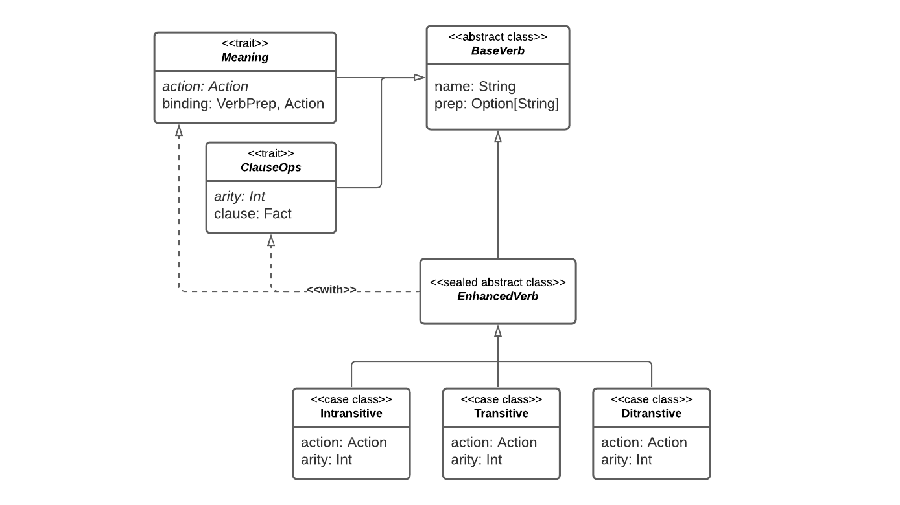

# Implementazione

<!--
Implementazione
(per ogni studente,
una sotto-sezione descrittiva di cosa fatto/co-fatto e con chi,
descrizione di aspetti implementativi importanti
non già presenti nel design)
-->

In questo progetto sono diversi i temi implementativi salienti riscontrati. Di
seguito sono descritti i punti principali, divisi in base all'autore o agli
autori che li hanno sviluppati.

## Aspetti trattati in comune

Alcuni task relativi allo sviluppo del software hanno richiesto l'attenzione di
tutti i membri del team, in sedute comuni di programmazione e di scambio d'idee.
Tra questi:

- task relativi a sezioni strategiche del software;
- task particolarmente complessi, tali da richiedere competenze possedute da più
  sotto-team;
- task relativi allo sviluppo di sezioni "cuscinetto" tra moduli differenti,
  tali da richiedere conoscenze riguardo a strutture sviluppate separatamente da
  sotto-team differenti.

È possibile individuare i seguenti task con queste caratteristiche:

- Lo sviluppo degli esempi;
- Il lavoro delle primissime iterazioni, nelle quali è stata posta la base di
  progetto, e la suddivisione in più sotto-progetti Gradle;
- Lo sviluppo delle strutture alla base del model;
- Lo sviluppo delle strutture alla base della pipeline.

## Aspetti trattati in sotto-team

Allo scopo di rendere il lavoro parallelo e flessibile, gran parte del lavoro è
stato spartito tra due sotto-team, con responsabilità legate a parti di progetto
differenti.

### Team 1

Il team 1 è composto dai membri Riccardo Maldini, Jacopo Corina, Thomas
Angelini. Sono stati trattati specifici aspetti del `Core`, legati in generale
alla definizione del modello. Nello specifico:

- sviluppo di buona parte del **modello**, e del sotto-modulo `commons`,
  corrispondente a grandi linee al package `model`;

- sviluppo di componenti interni al modulo `pipeline`, quali `resolver`,
  `interpreter` e `reducer`.

#### Dettagli implementativi

I dettagli implementativi degli aspetti principali trattati dal team 1 sono
esposti quì di seguito.

##### Model

Riguardo alla definizione del modello, vanno sottolineate le seguenti scelte
implementative:

- A causa delle dipendenze circolari tra `Room`, `Item` e `State`, tali entità
  sono state definite all'interno di un abstract class comune, denominato
  `Model`, e implementati tramite il meccanismo dei path dependent types. Tale
  scelta ha influenzato il resto dell'implementazione, determinando la necessità
  di espandere l'implementazione in una gerarchia che parte da essa.

- L'implementazione del `Model` basata sul meccanismo dei behavior viene
  integrata tramite l'utilizzo dell'abstract class `BehaviorBasedModel`.
  All'interno di questa vengono definiti i concetti di `BehaviorBasedItem`,
  `ItemBehavior`, `BehaviorBasedGround`, `GroundBehavior`. Le "combinazioni" di
  `Action` e `Item` in grado di far scattare comportamenti vengono definiti in
  dei `Set` interni agli stessi, contenenti dei `GroundTriggers` e
  `ItemTriggers`. Questi non sono altro che wrapper per
  `PartialFunction[(Action, State), Reaction]` e
  `PartialFunction[(Action, Option[Item], State), Reaction]`, sulla base dei
  quali vengono implementati i metodi `BehaviorBasedGround::use()` e
  `BehaviorBasedItem::use()`, combinando tra loro tramite `::lift()` tutti i
  triggers propri di un certo behavior.

- Internamente, `Room` e `Item` sono completamente descritti dal proprio
  riferimento (`RoomRef` e `ItemRef`); comportamento implementato effettuando
  l'override dei metodi `::equals()` e `::hashCode()` degli stessi, abilitando
  il confronto sulla base appunto dei soli ref, anziché sull'hashcode
  dell'intero oggetto. Ciò permette di comparare tra di loro `Room` (o `Item`)
  che, pur rappresentando lo stesso concetto, hanno delle differenze legate
  all'implementazione, rendendo al contempo più agevoli i test.

- A livello implementativo, le `Room` non contengono al loro interno gli `Item`
  concreti presenti al loro interno, ma i soli riferimenti alle stesse. Per
  restituire gli `Item` concreti, la `Room` deve risolverli, prendendo in input
  lo `State`, il quale contiene la `Map` che memorizza gli `Item` effettivi. Ciò
  evità ad esempio inconsistenze tra i dati.

- Le case class che implementano i `BehaviorBasedItem` sono intese come delle
  categorie di oggetti (ad esempio: la categoria di oggetti `Key` denota
  l'insieme di oggetti che potenzialmente potrebbero aprire un item di tipo
  `Door`). In fase di costruzione degli stessi, gli `ItemBehavior` che
  caratterizzano gli item vengono passati come delle higher order function
  `I => ItemBehavior`, eseguite una volta costruito l'oggetto. Questo in quanto
  gli `ItemBehavior` necessitano di un subject, ovvero di un riferimento agli
  item che li hanno generati.

##### Commons

Commons contiene una serie di componenti pre-implementati e utility, pensati per
facilitare allo storyteller lo sviluppo della propria storia.

Tale package è formato da alcuni sotto-package i quali si basano su un pattern
comune, ovvero molto spesso le classi sono interne a un trait il quale estende
`BehaviorBasedModel`. Questa scelta implementativa deriva dal fatto che le
classi interne devono avere necessariamente avere i type `I`, `G` di un istanza
model che usufruisce del concetto di `Behavior`, da qui la necessità di
ereditarli da una classe che li contenga entrambi, in questo caso
`BehaviorBasedModel`.

Altrettanto spesso viene adoperato per ogni sotto-package un trait che sia
formato dal mixin di tutti i trait specifici. Tale trait, quindi, permetterà col
suo singolo mix di avere i concetti contenuti dai trait più specifici. Tale
interfaccia deve estendere `BehaviorBasedModel` per le motivazioni descritte
precedentemente.

I package da `commons` contenuti sono i seguenti:

- `actioning` contente implementazioni di `Action` e `Verb`. Tutte le `Action`
  derivano dall'applicazione dei `Behavior` sul `Ground` o sugli `Items`;

- `groundBehavior` è un package contente alcune implementazioni di `Behavior`
  utilizzabili da un `Ground`. Tali `Behavior` sono:

  - `GenericGroundBehavior` è utilizzata per creare completamente un `Behavior`
    generico. Tale classe contiene solamente il trigger;
  - `InspectableBag` fornisce all'utente la possibilità d'ispezionare gli
    elementi presenti all'interno della `Bag`;
  - `InspectableLocation` fornisce all'utente la possibilità d'ispezionare gli
    elementi presenti all'interno di una `Room`;
  - `Navigable` fornisce all'utente la possibilità di muoversi attraverso le
    `Room`.

- `grounds` è un package contente un implementazione di un `Ground` tale che
  contenga tutti i `Behavior` precedentemente descritti;

- `itemBehavior` è un package contente alcune implementazioni di `Behavior`
  utilizzabili per un `Item`. Tali `Behavior` sono:

  - `GenericItemBehavior` è utilizzata per creare completamente un `Behavior`
    generico. Tale classe contiene solamente il trigger;
  - `Takeable` fornisce all'`Item` la possibilità di essere inserito dal
    `Player` all'interno della `Bag`;
  - `Eatable` fornisce all'`Item` la possibilità di essere mangiato dal
    `Player`;
  - `Openable` fornisce all'`Item` la possibilità di essere aperto dal `Player`.
    Esistono due tipi di `Openable`:
    - `Item` apribili solamente da una specifica chiave;
    - `Item` sempre apribili.
  - `RoomLink` fornisce all'`Item` la possibilità di collegare due `Room`.
    Questo conferisce la possibilità al `Player` di muoversi dalla prima alla
    seconda stanza. Molto spesso questo concetto è legato anche al comportamento
    `Openable`, in tal caso all'apertura di un `Openable Item` viene attivato
    l'effetto di `RoomLink`;
  - `Container` fornisce all'`Item` la possibilità di contenere altri `Item`. Il
    `Container` una volta aperto (comportamento `Openable`) inserisce gli `Item`
    da lui contenuti all'interno della stanza dove risiede. Da questo momento in
    poi gli `Item` diventano visibili dall'utente.

- `items` è un package contente alcune implementazioni di `Item`. Tali `Item`
  sono:

  - `GenericItem` è utilizzata per creare un `Item` generico, ovvero senza
    `ItemBehavior` specifici. Al suo interno contiene un `ItemDescription`, un
    `ItemRef` e una sequenza di builder per generare un `ItemBehavior`;
  - `Chest` è una tipologia di `Item` che contiene il comportamento `Container`;
  - `Food` è una tipologia di `Item` che contiene il comportamento `Eatable`;
  - `Door` è una tipologia di `Item` che contiene il comportamento `Openable`
    all'interno di `RoomLink`;
  - `Key` è una tipologia di `Item` utile ad aprire `Item` di tipo `Openable`
    nel caso in cui questi non siano apribili altrimenti. Un `Item` di tipo
    `Key` può essere:
    - `disposable` se scompare all'uso (default);
    - non `disposable` se rimane nel gioco nella `Room` corrente dopo l'uso.

- `pushing` è un package contente alcune implementazioni di `Message` e una per
  `Pusher`. Quest'ultima riconosce tutti i `Message` del package `pushing` e
  produce risposte sotto forma di stringa. Tali messaggi sono già gestiti dal
  `Pusher`, ma la risposta può anche essere personalizzata dallo storyteller
  all'interno della storia personale;

- `reactions` è un package contenente alcune implementazioni di `Reaction`
  basate sui `Behavior` presenti nei package `itemBehavior` e `groundBehavior`.
  Tali `Reaction` sono:
  - `modifyBag` modifica gli `Item` presenti nella `Bag`;
  - `modifyLocationItems` modifica tutti gli `Item` presenti nella location
    `Room`;
  - `switchLocation` cambia la location corrente del `Player`. Questo implica
    che il player si sia spostato in un altra stanza;
  - `addMessage` aggiunge un nuovo `Message`;
  - `modifyRoomItems` modifica tutti gli `Item` presenti in una generica `Room`.
    Questa `Reaction` generalizza `modifyLocationItems`;
  - `addDirectionToLocation` aggiunge una nuova `Direction` verso la quale il
    `Player` può muoversi.
  - `finishGame` termina il gioco sia in caso di vittoria e sconfitta per il
    `Player`.

`commons` contiene anche un trait `CommonsExt` che fornisce tutti gli elementi
del package stesso. Il trait deve essere adoperato attraverso il meccanismo dei
mixin con la classe `BehaviorBasedModel` dalla quale estrae i tipi.


##### Resolver, Interpreter, Reducer

- **Resolver**: Una classe astratta `AbstractSyntaxTreeResolver`, utilizzando il
  pattern "template method", fornisce una gestione completa delle possibili
  casistiche ottenibili dal risultato della parte di parsing `ParsingResult`: l'
  abstract syntax tree contenuto nel risultato viene distinto mediante pattern
  matching sulle classi `AbstractSyntaxTree.Intransitive`,
  `AbstractSyntaxTree.Transitive` e `AbstractSyntaxTree.Ditransitive`. In ultimo
  caso, se la classe non fosse di una delle ammesse, verrebbe restituita una
  stringa, contenente potenzialmente il messaggio di errore, ed essa sarà
  propagata come risultato alternativo del ciclo di pipeline. Nei casi ammessi,
  vengono estratti gli attributi presenti e si verifica se essi sono presenti
  tra le `actions` e gli `items` ammessi, tornando in caso affermativo uno
  `Statement` di tipo corrispondente a quello matchato, che sarà wrappato da un
  oggetto `ResolverResult`. Se vi fossero mancate corrispondenze con `actions` o
  `items`, al pari della casistica di errore precedente, verrebbe restituita una
  stringa di errore. La classe `Resolver` fornisce una possibile implementazione
  di `AbstractSyntaxTreeResolver`, definendo nel metodo `actions` il controllo
  se la action passata sia tra quelle definite nello stato, e definendo nel
  metodo `items` la ricerca di essi nello scope di gioco (insieme degli oggetti
  presenti nella bag o nella location del player) basandosi su un **criterio di
  confronto** tra `ItemDescription` dell' oggetto con quella degli altri nello
  scope, secondo il quale per poter avere un match, il nome deve essere il
  medesimo ed eventuali aggettivi dell' oggetto ricercato devono essere un
  sottoinsieme dell' altro oggetto preso in considerazione. Per esemplificare,
  se nello scope fosse presente una sola mela (senza aggettivi) e si cercasse
  una mela verde, non si otterrebbe alcuna corrispondenza. Se fosse presente una
  mela verde e si cercasse una mela rossa, non si avrebbe alcuna corrispondenza,
  mentre se fossero presenti entrambe le mele con aggettivi e se ne cercasse una
  senza alcuno vi sarebbero corrispondenze multiple quindi si renderebbe
  necessaria una disambiguazione.

- **Interpreter**: Utilizzando `ResolverResult` ottenuto da `Resolver`, la
  classe `Interpreter` si occupa di eseguire un pattern matching sullo
  `Statement` contenuto in esso, distinguendolo in base alla classe
  `Intransitive`, `Transitive`, `Ditransitive`. In assenza di match, viene
  restituito, come nel caso riportato in `Resolver`, una stringa di errore. Nel
  caso `Intransitive` il metodo `::use` è invocato su un oggetto di tipo
  `Ground`, che rappresenta un sorta di oggetto "virtuale" ed è contenuto all'
  interno dello stato. Nei casi `Transitive` e `Ditransitive` è stata utilizzata
  una classe di utility chiamata `RefToItem`, che consiste in un extractor da
  utilizzare per ottenere l' `Item` partendo da `ItemRef`, reperendolo da un
  dato dizionario degli elementi, in questo caso quello contenuto all' interno
  dello stato. In questi ultimi 3 casi, viene restituita una `Reaction` wrappata
  all' interno di un oggetto `InterpreterResult`.

**Reducer**: Utilizzando `InterpreterResult` ottenuto da `Interpreter`,
prendendo la `Reaction` contenuta, essa viene applicata sullo stato. Il
risultato, nella implementazione realizzata, consiste in una tupla contenente 2
elementi

- stato aggiornato a seguito dell' applicazione della `Reaction`
- messaggi per lo user, generati a seguito dell' applicazione della `Reaction`

Questa tupla è wrappata all' interno della classe `ReducerResult`.

#### Responsabilità personali

Personalmente ogni elemento del team ha svolto dei task specifici, legati ai
task principali del team, ma non esclusivamente:

- **Thomas Angelini**: Il membro ha gestito lo sviluppo del sotto-modulo
  `commons` all'interno di `model.behaviorBased`, ha redatto una buona parte di
  ScalaDoc e spesso coinvolto in molti test. La maggior parte del lavoro è stato
  svolto in concomitanza con gli altri membri del team.

* **Jacopo Corina**: Oltre alle parti svolte assieme agli altri membri, il
  membro ha contribuito a creare la struttura base del meccanismo dei behavior e
  alla relativa integrazione, per poi ulteriormente svilupparla assieme agli
  altri membri. In particolare ha contribuito alla creazione dei vari item di
  gioco con behavior annessi e alla parziale implementazione delle componenti
  `Resolver`, `Interpreter`, `Reducer`.

  Inoltre, si è dedicato alla predisposizione iniziale ed all'ottimizzazione dei
  workflow CI ed alla esplorazione dei possibili metodi di release per il codice
  sorgente, gli eseguibili degli esempi, la generazione dei report e la parziale
  implementazione essi

- **Riccardo Maldini**: Il membro ha curato in particolare lo sviluppo delle
  entità di base del **model**, e parte della sua implementazione principale
  basata su behavior. Gran parte del lavoro riguardo questo aspetto è stato ad
  ogni modo portato a termine nel contesto del team 1.

  Oltre a ciò, il membro è responsabile dello sviluppo di vari task minori:

  - Ruolo di Scrum Master, e in generale di coordinatore del backlog;
  - Sviluppo di parte dei workflow CI/QA,
  - predisposizione della prima base progettuale Gradle basata su convention
    plugin e submodule
  - Sviluppo di parte dei workflow di release.

### Team 2

Il team 2 è composto dai membri Filippo Nardini, Francesco Gorini. Sono stati
trattati specifici aspetti del `core`, legati in generale alla definizione
dell'engine di gioco, e alla struttra di base del modulo `cli` Nello specifico:

- Package `core`:

  - `dictionary` con tutti i suoi elementi;
  - `pipeline` in particolare gli elementi `Lexer` e `Parser`;
  - `application` con tutti i suoi elementi;
  - `parsing` con tutti i suoi elementi.

- Package `cli`.

Occorre sottolineare che i concetti son stati sviluppati totalmente in "pair
programming". Tuttavia, successivamente, vengono descritti quali sono le parti
di cui personalmente un membro del team è responsabile.

#### Dettagli implementativi

##### Generators

Le type class `Generator` e `GeneratorK` che si trovano all'interno di questo
modulo sono state realizzate utilizzando le type class offerte da Cats.
L'implementazione di `Generator[A, B]` risulta essere un banale wrapper di una
funzione `A => B,` mentre l'implementazione di `GeneratorK[F[_], A, B]` richiede
che siano state definite istanze per le seguenti type class:

- `Generator[A, B]:` essere in grado di generare da ogni valore a: A un output
  b: B;
- `Functor[F]` e `Foldable[F]:` in quanto sono necessarie le funzioni map e
  fold, per trasformare all'interno ed infine estrarre un valore b: B a partire
  dal contesto `F[_];`
- `Monoid[B]:` in quanto è necessaria un'operazione binaria associativa e un
  valore empty per effettuare l'operazione di fold.

##### Dictionary

Contiene i costrutti, realizzati tramite algebraic data types, che consentono la
dichiarazione di verbi, utilizzati in fase di scrittura di una storia da parte
dello storyteller. A partire da un verbo deve essere possibile generare le
seguenti informazioni:

- una regola Prolog, che descrive la grammatica del verbo;
- una tupla `(Verb, Preposition) -> Action` (o `Verb -> Action`), che collega
  l'uso del verbo al suo significato.



Contiene inoltre una funzione in grado di generare, a partire dal dizionario di
una storia e dalla grammatica di base, una teoria Prolog utilizzata per
inizializzare un `Engine`. Per fare ciò utilizza due istanze di
`GeneratorK[List, Verb, Program]` e `GeneratorK[List, Item, Program],` in grado
di generare per ogni classe di elemento del dizionario un programma Prolog
valido. Infine questi programmi vengono concatenati tra di loro e alla
grammatica di base.

##### Scalog

Questo package contiene le strutture necessarie per la modellazione di
espressioni Prolog. La realizzazione della gerarchia è avvenuta tramite
algebraic data types e ha origine nel tipo `CodeGen`, una struttura in grado di
generare un'espressione Prolog sotto forma di stringa, che in seguito si
suddivide in `Clause` e `Term`, che rappresentano rispettivamente una clausola e
un termine (@fig:scalog_hierarchy).

{#fig:scalog_hierarchy}

I tipi di clausola che sono stati modellati sono:

- `Fact`, che rappresenta un semplice fatto senza corpo;
- `Rule`, che rappresenta una clausola di Horn con testa e corpo;
- `DCGRule`, che rappresenta una clausola espressa in forma DCG.

I tipi di termine che sono stati modellati sono:

- `Atom`, che rappresenta un atomo;
- `Number`, che rappresenta un numero (è stato modellato il solo uso di numeri
  interi);
- `Variable`, che rappresenta una variabile;
- `Compound`, che rappresenta un termine composto da funtore e argomenti;
- `ListP`, che rappresenta una lista.

Inoltre è stato implementato un piccolo DSL, che consente la creazione di
clausole e termini tramite una sintassi molto simile a quella di Prolog (esempio
in @lst:scalog_dsl).

```{#lst:scalog_dsl .scala caption="Esempio di utilizzo del DSL per la creazione di una regola DCG."}
import io.github.scalaquest.core.parsing.scalog.dsl._
import io.github.scalaquest.core.parsing.scalog._
val hello = CompoundBuilder("hello").constructor
val X = Variable("X")
(hello(X) --> ListP("hello", X)).generate
// val res0: String = "hello(X) --> [hello,X]."
```

L'uso di algebraic data types rende molto semplice il pattern matching, rendendo
l'uso di queste strutture molto comodo come formato di scambio dati tra diversi
componenti, per esempio tra `PrologParser` e `Engine`. A tal fine sono stati
introdotti ulteriori metodi per rendere il pattern matching ancora più
espressivo (esempio in @lst:scalog_matching).

```{#lst:scalog_matching .scala caption="Esempio di utilizzo del DSL per il pattern matching di una struttura."}
val nickname = CompoundBuilder("nickname").extractor.toStrings
val record = Compound("nickname", "robert", List("bob"))
record.generate
// val res0: String = "nickname(robert, bob)"

record match {
  case nickname(_) => "wrong usage of nickname/2"
  case nickname(_, _, _) => "wrong usage of nickname/2"
  case nickname(full, nick) => s"${nick} stands for ${full}"
  case _ => "you didn't say hello to anyone"
}
// val res1: String = "bob stands for robert"
```

##### Struttura di default dell'applicazione

All'interno del package `application`, tra i dettagli implementativi più
interessanti vi è l'utilizzo del pattern "Template Method" all'interno di
`DefaultPipelineProvider` per creare la pipeline di default. In particolare è
interessante notare che definendo solamente una teoria Prolog, sia possibile
fruire di una pipeline pronta all'uso.

<!-- diagramma delle classi -->

##### Parser

Nell'implementazione di `Parser` viene utilizzato nuovamente il pattern
"Template Method", con il notevole beneficio di poter sviluppare completamente
questa parte della pipeline senza dover necessariamente conoscere quale motore
Prolog venisse implementato. Per questo motivo è stato possibile creare il
package `parser` ben prima di sviluppare il modulo `engine`. Inoltre, in questo
modo il codice risulta essere particolarmente scalabile e modulare, in quanto in
maniera molto semplice ed in poco tempo, è possibile implementare un altro
motore Prolog, che ad esempio lavora con **SWI-Prolog**.

##### Natural Language Processing in Prolog

Il riconoscimento del linguaggio naturale in Prolog è basato su regole in forma
_definite clause grammar_. Questa modalità di esprimere regole consente di
definire facilmente un parser in Prolog.

Tramite l'uso di una semplice grammatica DCG come quella in @lst:nlp_grammar è
possibile riconoscere frasi in linguaggio naturale.

```{#lst:nlp_grammar .prolog caption="Una semplice grammatica per riconoscere frasi in lingua inglese. Fonte: https://en.wikipedia.org/wiki/Definite_clause_grammar"}
sentence(s(NP,VP)) --> noun_phrase(NP), verb_phrase(VP).
noun_phrase(np(D,N)) --> det(D), noun(N).
verb_phrase(vp(V,NP)) --> verb(V), noun_phrase(NP).
det(d(the)) --> [the].
det(d(a)) --> [a].
noun(n(bat)) --> [bat].
noun(n(cat)) --> [cat].
verb(v(eats)) --> [eats].
```

frase imperative (verbo senza soggetto) tutto sulla grammatica

##### Engine Prolog

Questa soluzione utilizza il pattern "Adapter" per wrappare e permettere di
utilizzare la libreria **tuProlog** all'interno del codice. Successivamente
questa è stata arraggiata per modellare correttamente il nostro dominio; ad
esempio è stata creata una interfaccia `engine` la quale prevede di essere
definita solamente attraverso `theory` e `library`.

Occorre sottolineare che in alcuni parti del codice, vengono gestite solo
parzialmente le eccezioni che potrebbero essere sollevate nell'utilizzo del
Prolog. Questa scelta è stata dettata da un duplice fattore: il codice
altrimenti si sarebbe notevolmente "sporcato" con l'utilizzo di costrutti
try/catch o di Option. Tuttavia, questa parte viene utilizzata e gestita
interamente da i membri del team e quindi sappiamo come rispettare le
interfacce, evitando di sollevare eccezion.


##### Modulo `cli`

Questo modulo si occupa di fornire dei costrutti per creare un'applicazione a
linea di comando che consenta di interagire con un'istanza di gioco. La sua
implementazione è basata sul framework **ZIO**, che consente di creare effetti
(ovvero codice con side-effects) tramite costrutti type-safe, funzionali, quindi
facilmente componibili e testabili. 

L'interfaccia principale è `CLI`, ovvero un wrapper per un effetto `ZIO[Console,
IOException, Unit]`, che può essere semplificato in `Console =>
Either[IOException, Unit]`, ovvero una funzione che necessita di
un'implementazione di `Console` e ritorna un'eccezione di tipo IO oppure un
valore unit. **ZIO** offre un costrutto `App` che fornisce tramite un template
method di realizzare facilmente un'applicazione eseguibile. Questo è stato
esteso per creare `GameCLIApp`: una classe astratta, configurabile con istanze
di `Model`, `State`, `MessagePusher` e gli elementi del dizionario tramite
template method, realizza un applicazione eseguibile costruendo un'istanza di
`Game` tramite una `Pipeline` di default.

{#fig:cli_hierarchy}

#### Responsabilità personali

All'interno del team, le responsabilità di ognuno di noi sono:

- **Filippo Nardini**: il membro del team si è preoccupato di curare
  particolarmente le parti riguardanti il sottoprogetto _cli_, soprattutto per
  quanto concerne l'utilizzo di **ZIO**. In aggiunta si è occupato anche della
  parte di `dictonary`. Infine, per quanto riguarda il linguaggio Prolog, è
  responsabile della parte comprendente la modellazione della grammatica
  attraverso algebraic-data type e di tutte le altre parti presenti nel package
  `scalog`.

* **Francesco Gorini**: il membro ha contribuito alla stesura dei primi due
  componenti del package `pipeline`, ovvero Lexer e Parser. In aggiunta è
  responsabile di quanto è stato creato dentro il package `application`,
  comprendente tutte le parti necessarie per fornire una struttura di base
  implementabile. Inoltre il membro si è occupato della parte riguardante il
  motore Prolog, l'interfacciamento con la libreria tuProlog e tutto ciò che
  comprende il package `engine`.

<!--
Possibilmente si può fare anche ##### dettaglio_implementativo (membro_responsabile)
-->
